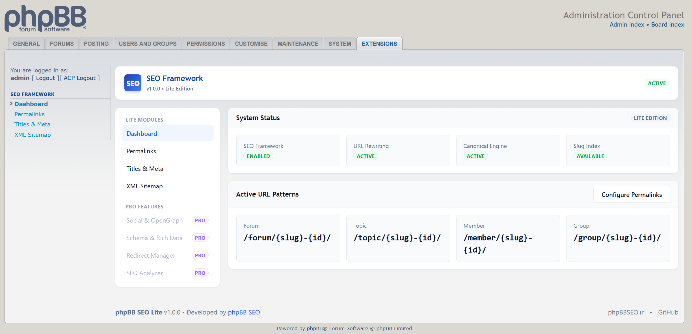
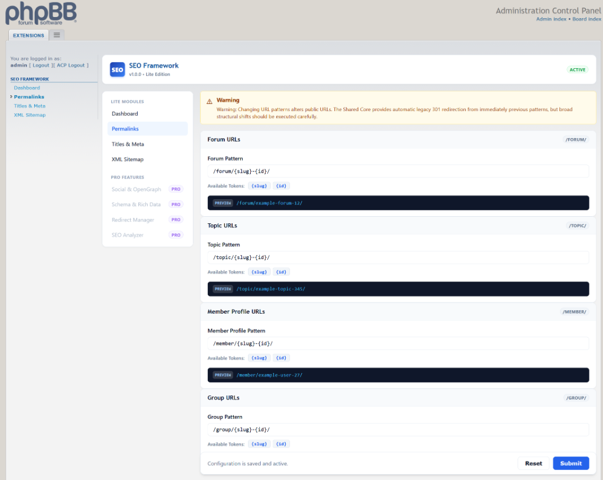
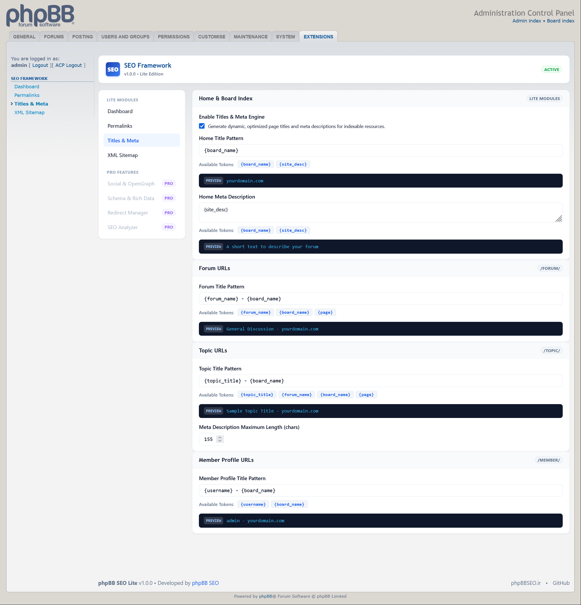
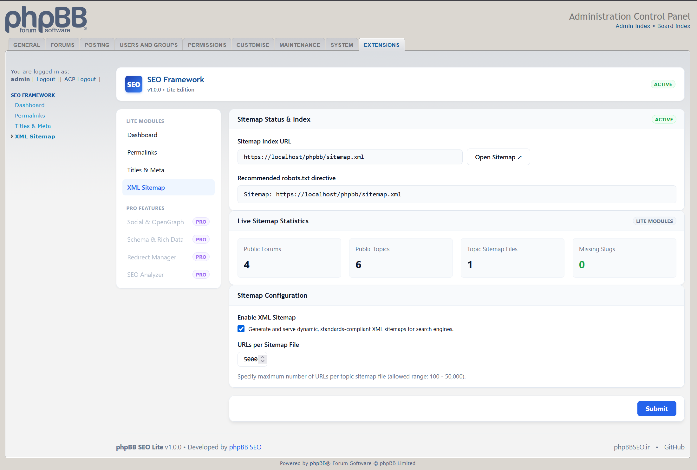

# phpBB SEO Framework

Modern SEO infrastructure for phpBB.

[](https://www.phpbb.com/)
[](https://php.net/)
[](LICENSE)
[](https://github.com/phpbb-seo/seo-framework/releases)

---

## Overview

**phpBB SEO Framework (Lite Edition v1.0.1)** is the official next-generation search engine optimization platform for phpBB 3.3.x boards. Built for high performance, clean software architecture, and web standards compliance, it provides a zero-SQL hot-path URL rewrite engine, dynamic metadata tools, and a keyset-based XML sitemap suite.

* **Official Website**: [https://www.phpbbseo.com/](https://www.phpbbseo.com/)
* **GitHub Repository**: [https://github.com/phpbb-seo/seo-framework](https://github.com/phpbb-seo/seo-framework)

---

## Key Features

### SEO URL Engine
* **Zero SQL on Hot Path**: Runtime outbound link rewriting via `append_sid()` executes with **0 database queries**.
* **Configurable Permalinks**: Flexible URL pattern templates for Forums, Topics, Member Profiles, and Usergroups.
* **Persistent Slug Index**: Framework-owned persistent slug storage providing fast and deterministic URL resolution without modifying phpBB core tables.
* **Automatic 301 Canonical Redirects**: Seamlessly redirects legacy native URLs (`viewtopic.php?t=123`, `viewforum.php?f=4`) and renamed/stale slugs to current canonical URLs without search ranking loss.
* **Safe Inbound Routing**: Dedicated standalone pre-bootstrap router (`rewrite.php`) intercepting inbound clean URLs with minimal overhead.

### Titles & Meta
* **Custom Meta Titles & Descriptions**: Configurable pattern-based title templates for Home, Forum, Topic, and Member Profile pages.
* **Intelligent Text Normalization**: Strips BBCode, smilies, quotes, and HTML entities to produce clean plain-text Unicode descriptions.
* **Canonical Link Tags**: Injects authoritative `<link rel="canonical">` tags into every public resource.

### XML Sitemap
* **Standards Compliant**: Generates dynamic Sitemaps Protocol 0.9 feeds for search engines (Google, Bing, Yandex).
* **Zero-Offset Keyset Scalability**: High-efficiency keyset streaming architecture capable of handling large topic catalogues with bounded (< 5 MB) memory usage and **zero SQL offset overhead**.
* **Strict Anonymous ACL Isolation**: Guarantees private and staff forums are never exposed in search sitemaps regardless of session state.
* **Human-Readable XSL Styling**: Responsive browser presentation (`/sitemap.xsl`) transforming raw XML feeds into styled dashboards.

### Multilingual / Unicode Support
* **Full UTF-8 Support**: Native Unicode slug generation across Persian, Arabic, Cyrillic, Latin, and CJK alphabets.
* **Fallback Transliteration**: Graceful handling of diverse alphabets and character sets.

---

## Screenshots

### SEO Dashboard


### Permalink Manager


### Titles & Meta


### XML Sitemap


---

## Requirements

* **phpBB**: 3.3.0 or higher (tested and verified on phpBB 3.3.x)
* **PHP**: 8.1, 8.2, or 8.3 (tested and verified on PHP 8.2 & 8.3)
* **Supported Web Servers**:
  - Apache 2.4+ (with `mod_rewrite` enabled)
  - LiteSpeed
  - Nginx

---

## Installation

1. Download the latest `phpbb-seo-lite-x.x.x.zip` from the [Releases](https://github.com/phpbb-seo/seo-framework/releases) page.

2. Extract and upload the extension so the final path is:
   ```
   ext/phpbbseo/framework/
   ```

3. Configure your web server rewrite rules:

   ### Apache / LiteSpeed
   Add the following rule to your phpBB root `.htaccess` file:
   ```apache
   <IfModule mod_rewrite.c>
       RewriteEngine On

       RewriteCond %{REQUEST_FILENAME} !-f
       RewriteCond %{REQUEST_FILENAME} !-d
       RewriteRule ^(.*)$ ext/phpbbseo/framework/rewrite.php [QSA,L]
   </IfModule>
   ```

   ### Nginx — phpBB installed at domain root
   Add the following directive inside your Nginx server block:
   ```nginx
   location / {
       try_files $uri $uri/ /ext/phpbbseo/framework/rewrite.php?$query_string;
   }
   ```

   ### Nginx — phpBB installed in a subdirectory
   If phpBB is installed in a subdirectory (e.g. `/forum/`):
   ```nginx
   location /forum/ {
       try_files $uri $uri/ /forum/ext/phpbbseo/framework/rewrite.php?$query_string;
   }
   ```

4. In your phpBB Administration Control Panel (ACP), navigate to:
   **Customise** &raquo; **Manage Extensions**

5. Locate **phpBB SEO Framework** under *Disabled Extensions* and click **Enable**.

6. Navigate to the new **SEO Framework** tab in the ACP to configure your settings.

---

## Configuration

* **Dashboard**: Displays extension status, active URL patterns, and system health metrics.
* **Permalinks**: Select URL presets or define custom permalink structures for forums, topics, users, and usergroups.
* **Titles & Meta**: Configure pattern tokens (e.g. `{topic_title}`, `{forum_name}`, `{board_name}`) and meta description lengths.
* **XML Sitemap**: Enable XML sitemaps, customize URLs per sitemap file, view live crawl statistics, and copy recommended `robots.txt` directives.

---

## Lite vs Pro

phpBB SEO Framework is architected with a unified Shared Core foundation:

| Feature / Module | phpBB SEO Lite (v1.0.1) | phpBB SEO Pro (Planned) |
| :--- | :---: | :---: |
| **Shared Core SEO URL Engine** | ✅ Included | ✅ Included |
| **Persistent Slug Index** | ✅ Included | ✅ Included |
| **Canonical Redirections (301)** | ✅ Included | ✅ Included |
| **Configurable Permalinks** | ✅ Included | ✅ Included |
| **Titles & Meta Engine** | ✅ Included | ✅ Included |
| **XML Sitemap Suite** | ✅ Included | ✅ Included |
| **Multilingual / Unicode Slugs** | ✅ Included | ✅ Included |
| **OpenGraph & Social Cards** | ❌ Planned | ✅ Pro |
| **JSON-LD Schema & Rich Data** | ❌ Planned | ✅ Pro |
| **404 & Redirect Manager** | ❌ Planned | ✅ Pro |
| **On-Page SEO Analyzer** | ❌ Planned | ✅ Pro |

*Pro features will extend the same Shared Core APIs without duplicate URL generation systems or separate routing tables.*

---

## Migrating from Legacy USU

* Existing **Ultimate SEO URL (USU)** installations should **NOT** replace USU blindly.
* USU and phpBB SEO Framework use fundamentally different internal architectures.
* A documented migration path will be provided separately in an upcoming guide.
* For existing installations depending on historical USU URLs, maintain the legacy repository at [https://github.com/phpbb-seo/usu](https://github.com/phpbb-seo/usu).

---

## Documentation & Support

* **Official Website**: [https://www.phpbbseo.com/](https://www.phpbbseo.com/)
* **GitHub Repository**: [https://github.com/phpbb-seo/seo-framework](https://github.com/phpbb-seo/seo-framework)
* **Issue Tracker**: [https://github.com/phpbb-seo/seo-framework/issues](https://github.com/phpbb-seo/seo-framework/issues)

---

## License

phpBB SEO Framework is open-source software licensed under the **GNU General Public License v2 (GPL-2.0-only)**.

---

## Credits / Project

Developed and maintained by **[phpBB SEO](https://www.phpbbseo.com/)**.  
Copyright &copy; 2026 phpBB SEO. All rights reserved.
